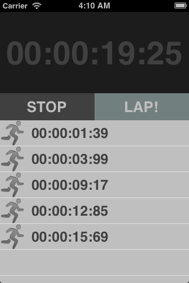

# Chapter 1
## Stopwatch (with Lap Counter) 


This chapter guides the reader in creating a standalone Stopwatch application. This first application is pretty straight forward, but it covers the interaction between user interface elements as well a data-structures. 
###Topics covered:
- Starting and stopping the stopwatch
- Displaying current time with big numbers
- Storing time on new each lap
- Listing lap times
- Resetting the timer

By the end of this chapter, readers will have fully functional Stopwatch application with the ability to see the time for each lap. 
