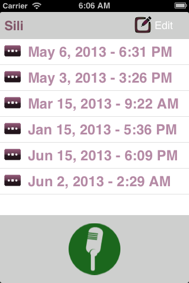

# Chapter 2
## Silly, the assistant that just listens

This chapter guides the reader in creating a voice recorder application. While Siri “interprets” what the user is saying. This application simply “listens” by storing the recordings on the device for later use. It covers media management s well as file system access on the device.

###Topics covered:
- Recording and saving the message in a single button press
- Playing back the recorded message
- Storing more than one recording
- Listing all stored recordings
- Selecting and playing a specific recording
- Deleting a specific recording

By the end of this chapter, readers will have a fully featured voice recorder application where they can listen to their stored recordings on-demand. 