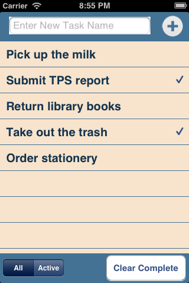

# Chapter 3
## To Do List 

This chapter guides the reader in creating a To Do Items management application. It allows the creation and deletion of Items, as well as the possibility to mark them as “done”. All items are persisted in a sqlite database. It covers the integration with an embedded database.

###Topics covered:
- Creating the database structure
- Creating a new To Do Item in database
- Listing all items from database
- Marking an item as “done”
- Deleting complete item
- Hiding “done” items

By the end of this chapter, user will have a running To Do management application where they can create, delete and mark items as “done”.