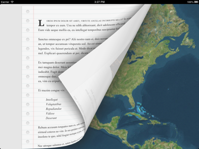

# Chapter 4
## Interactive eBook for iPad

This chapter guides the reader in creating an interactive electronic book (eBook) application with realistic page flipping. (Pretty much like a real book) This is an iPad specific application in order to benefit from the large screen resolution. It covers the integration and utilization of a native module as well a rich media presentation.

###Topics covered:
- Retrieving the Page Flip Navigation native Module (Free Edition)
- Adding the module to the project
- Using a WebView for richer presentation
- Including a MapView in a page
- Adding rich media in a page

By the end of this chapter, readers will have a running eBook with rich presentation and embedded media. Pages can be turned by dragging a page corner from one side to the next.
