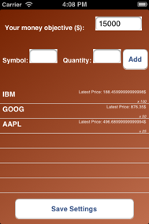

# Chapter 5
## You've got to know when to hold 'em 

This chapter guides the reader in creating a standalone Stock Portfolio application. It allows users to organize stocks (price and quantity). From there, the user selects an amount of money he wants to gain through his “investments”. The application will periodically retrieve stock prices from the web and calculate the sum of money earned. It will then indicate how far (or close) he is from his objective. It covers http API calls, Property persistence as well as a custom UI Control.

###Topics covered:
- Retrieving a stock value from the web
- Adding a stock to the Portfolio
- Determining the objective
- Retrieving all portfolio stock values
- Displaying investment progress

By the end of this chapter, readers will have an application that allows them to manage their stock portfolio as well as knowing when it is time to sell (or not).

