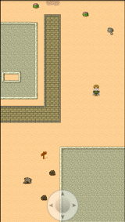

# Chapter 6
## J-RPG, make your own adventure game 

This chapter guides the reader in creating a native mobile game. The game slows players to roam around a map from a top view perspective, much like a classic Japanese RPG. It covers graphics manipulation and touch control.

###Topics covered: 
- Creating the map  
- Creating the main character 
- Having him move around the map
- Loading game assets into a game
- Interacting with the game using touch events

By the end of this chapter, readers will have a barebones game that allows the player to move freely around the map. 

###Map Editor
Maps used in this came were designed using the freely available [Tiled Map Editor](http://www.mapeditor.org).

###Graphics
All graphical assets are created to **Sith Jester** and are available on his website: [Sithjester's RPG Maker XP resources](http://untamed.wild-refuge.net/rpgxp.php).

Use of those assets is completely free as long as the artist is credited.

###Module
The application from this chapter uses the **QuickTiGame2d Game Engine** native module. It is available for download freely from the following URLs:

- [QuickTiGame2d Module 1.2 for iOS](http://bit.ly/Z8YsEw)
- [QuickTiGame2d Module 1.2 for Android](http://bit.ly/11rDRs7)

