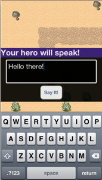

# Chapter 7
## JRPG - Second to Last Fantasy Online

This chapter guides the reader in adding online multiplayer functionality to a game. For the intent of this chapter, it reuses the code from the game created in chapter 6. It covers network interaction, intervals and testing.

###Topics covered:
- Understanding how the server handles multiplayer using Node.js
- Joining a game
- Sending current player information to the server
- Retrieving other online players information at a regular interval
- Applying retrieved information on device
- Testing multiplayer

By the end of this chapter, readers will have a game that allows the player to join in an online game with other players.

###Map Editor
Maps used in this came were designed using the freely available [Tiled Map Editor](http://www.mapeditor.org).

###Graphics
All graphical assets are created to **Sith Jester** and are available on his website: [Sithjester's RPG Maker XP resources](http://untamed.wild-refuge.net/rpgxp.php).

Use of those assets is completely free as long as the artist is credited.

###Modules
####Game Engine
The application from this chapter uses the **QuickTiGame2d Game Engine** native module. It is available for download freely from the following URLs:

- [QuickTiGame2d Module 1.2 for iOS](http://bit.ly/Z8YsEw)
- [QuickTiGame2d Module 1.2 for Android](http://bit.ly/11rDRs7)

####Socket.IO
**TiWS** is a Native Extension Module used for creating native Web Sockets and was developed by a gentleman named **Jordi Domenec**. It can be downloaded freely from the Appcelerator Marketplace:

- [TiWS Module 0.3 for iOS](http://bit.ly/1529TwA)
- [TiWS Module 0.1 for Android](http://bit.ly/142HLKG)

This source code is open-sourced under the Apache License, Version 2.0 and is available on [GitHub](http://bit.ly/L8eFzj).
