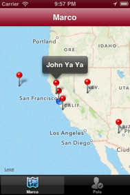

# Chapter 10: Worldwide Marco Polo 

TThis chapter guides the reader in creating a social application that allows users to “check-in” a location based on the device’s location. And then, share this check-in to the world using Appcelerator Cloud Services. It covers location services, Cloud integration and map view.

###Topics covered:
- Integrating Appcelerator Cloud Services
- Authenticating to the cloud
- Determining place from device’s location
- “Checking-in” to the cloud
- Retrieving nearby “Check-ins” from cloud
- Navigating using Tabs
- Displaying retrieved “Check-ins” on a MapView

By the end of this chapter, readers will have a complete application that allows them to “Check-into” a location and see on a Map others who checked-in nearby also using the app. 
