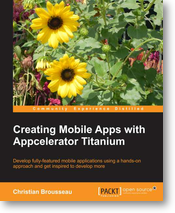

Creating Mobile Apps with Appcelerator Titanium
====================================

Creating Mobile Apps with Appcelerator Titanium will show you how to develop ten complete, fully featured mobile applications using a practical and hands-on approach. Get inspiration for developing you own applications with this book.

Chapter | Title
--- | ---
1 | [Stopwatch (with Lap Counter)](./01-StopWatch)
2 | [Silly, the assistant that just listens](./02-Sili)
3 | [The To-Do List](./03-ToDoList)
4 | [Interactive E-Book for iPad](./04-InteractiveBook)
5 | [You've Got to Know When to Hold 'em](./05-KennyStock)
6 | [J-RPG - Second to Last Fantasy](./06-SecondToLastFantasy)
7 | [JRPG - Second to Last Fantasy Online](./07-SecondToLastFantasyOnline)
7 | [JRPG - Second to Last Fantasy Online (Game Server Code)](./07-SecondToLastFantasyOnlineServer)
8 | [Social Networks](./08-UnifiedStatus)
9 | [Marvels of the World Around Us](./09-PhotoSurrounder)
10 | [Worldwide Marco Polo](./10-MarcoPolo)